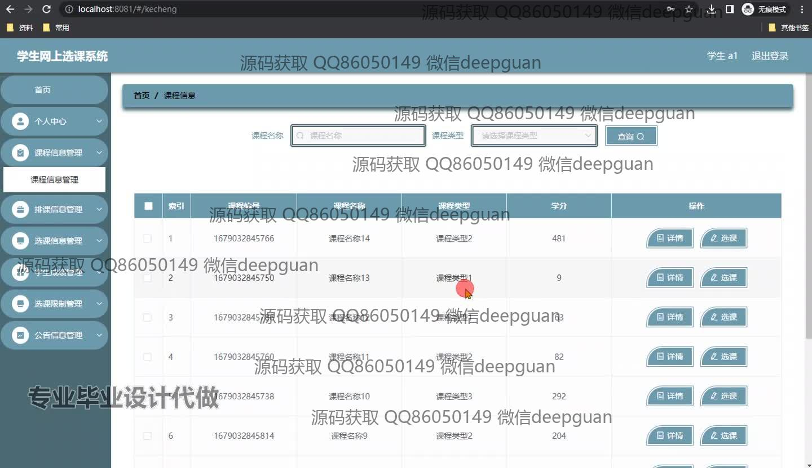
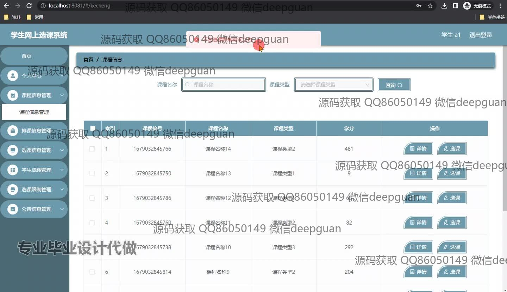
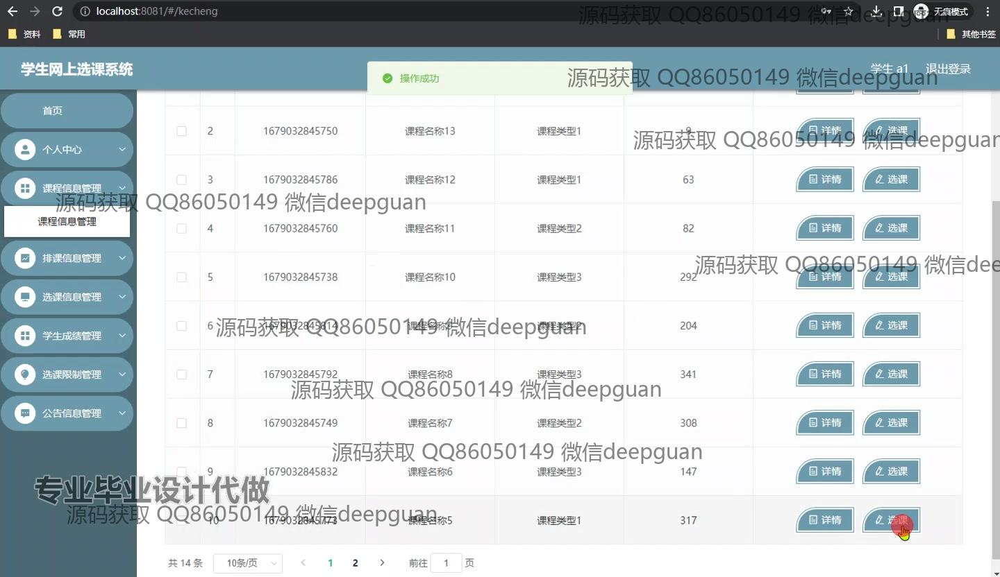
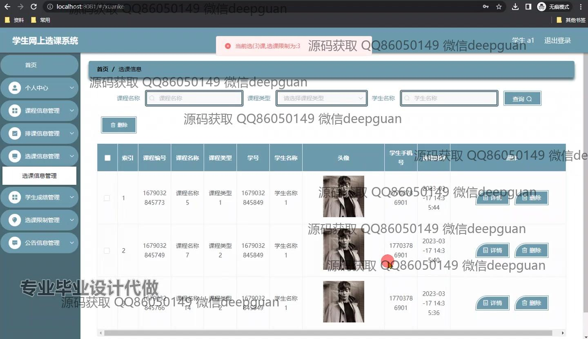
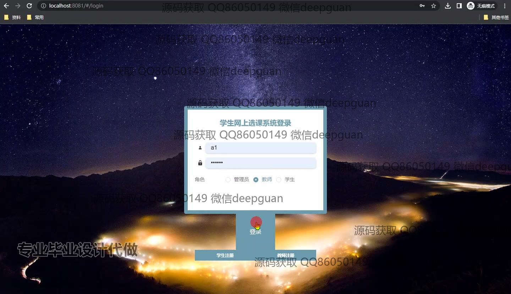
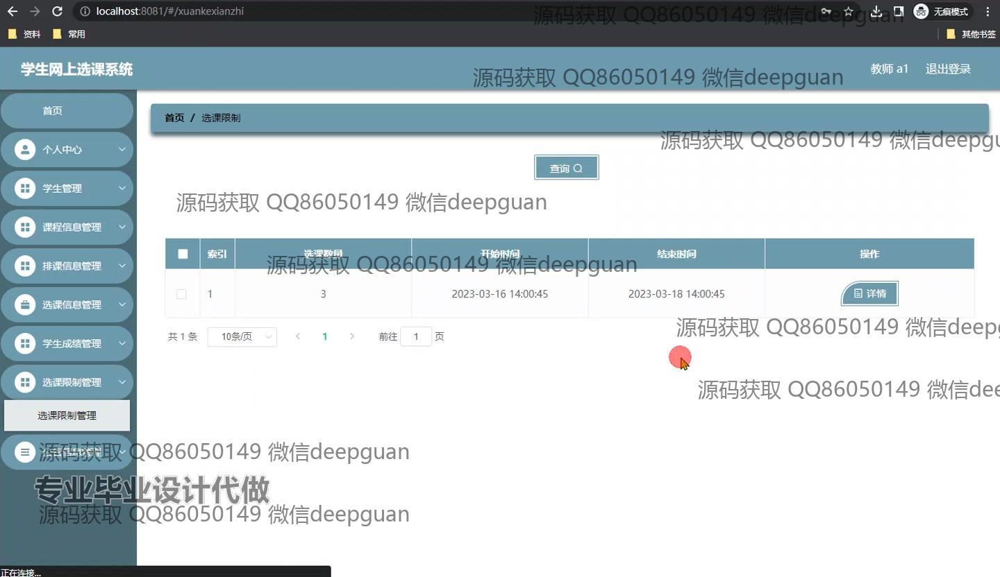
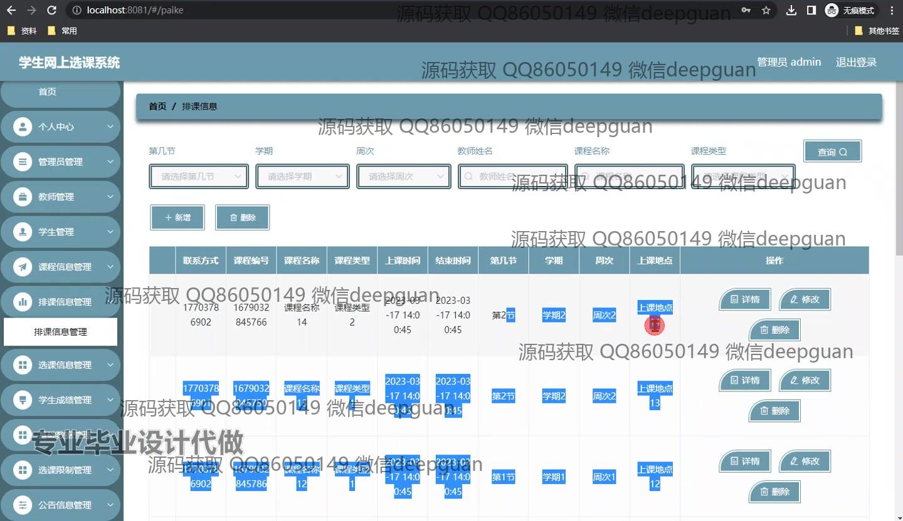

<h1 align="center">基于SpringBoot的学生网上选课系统</h1>

## 简介
基于SpringBoot的学生网上选课系统：角色分为管理员、教师和学生；功能包括课程信息管理、选课限制管理、学生成绩管理、公告管理、登录和注册功能，界面简洁直观，便于用户操作和管理。    --计算机毕业设计源码；毕设源码；java毕业设计源码

## 联系方式

<h3 align="center">获取完整代码与数据库文件 + 微信：deepguan QQ: 86050149 QQ群: 783742310</h3>

<h3 align="center">可帮忙远程部署 包运行成功！提供远程部署、修改代码、设计文档指导、代码讲解等服务！</h3>

## 功能介绍（完整见运行截图）
管理员：管理员可以通过系统进行登录、注册和退出操作，拥有管理全局的权限。管理员可以管理教师和学生的信息，通过功能菜单中的个人中心、管理员管理、教师管理、学生管理来查看或修改不同角色的资料。还可以查看课程信息、排课信息以及学生选课信息。此外，管理员可以设置选课限制，管理学生的选课数量和时间周期，并发布公共公告信息。

教师：教师可以登录系统并查看自己的授课安排，通过课程信息管理进行课程列表的查看和更新操作。教师也可以查看排课信息，并可以通过系统发布或管理与课程相关的公告信息，查看班级学生的选课状态，管理选课学生的信息，查看并记录学生的成绩。

学生：学生通过系统进行登录，注册后可以访问个人中心以管理个人资料。通过选课信息管理模块，学生可以选择和查看课程，查看课程的详细介绍并完成选课操作。学生也可以查看当前选课的限制时间和数量管理，查看自己的选课时间、选课课程以及根据结课后的成绩管理自己的成绩单信息。

用户：用户可以在主页上浏览和搜索课程，通过课程管理功能查看课程的基本信息，包括课程编号、名称和学分信息。用户能够查看系统公告和网站提示信息，通过搜索功能快速查找相关的内容。用户还可在选课信息管理模块查看课程安排，关注课程时间表并可通过选课功能进行有效的课程报名和删除操作。

## 运行截图

本代码来源于网络,仅供学习参考使用!

